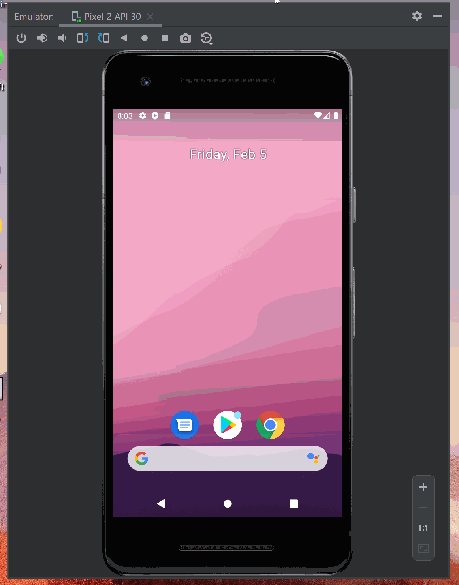

# Project 1 - *Simple_To_Do_App*

**Simple_To_Do_App** is an android app that allows building a todo list and basic todo items management functionality including adding new items, editing and deleting an existing item.

Submitted by: **Maryum Shabazz**

Time spent: **15** hours spent in total

## User Stories
* As a user I want to be able to view a list of to do items so I that I can see what I need to complete.
* As a user I want to be able to add and remove items from my to do list, so that I can keep an accurate list of what I have to complete.
* As a user I want to have my list of items persist so that each time I start up the app I can have my data saved and be able to retrieve it quickly. 

## Optional/Addditional User Stories
* As a user I want to be able to edit the items in my to do list so that I can quickly update my list without having to remove or add an item
* As a user I want dividers between the items of my to do list so the list is easily visualized. 
* As a user I want a aestheitically pleasing UI so that I want to use it more often

The following **required** functionality is completed:

* [X] User can **view a list of todo items**
* [X] User can **successfully add and remove items** from the todo list
* [X] User's **list of items persisted** upon modification and and retrieved properly on app restart

The following **optional** features are implemented:

* [X] User can **tap a todo item in the list and bring up an edit screen for the todo item** and then have any changes to the text reflected in the todo list

The following **additional** features are implemented:

* [X] Added dividers between list items
* [X] Added Keyboard collapse when not in use
* [X] Updated Color of Action Bar
* [X] Updated Color of Buttons
* [X] Added Color to List items.

## Video Walkthrough

Here's a walkthrough of implemented user stories:

GIF created with [LiceCap](http://www.cockos.com/licecap/).

## Notes

Describe any challenges encountered while building the app.

## License

    Copyright [ ] [ ]

    Licensed under the Apache License, Version 2.0 (the "License");
    you may not use this file except in compliance with the License.
    You may obtain a copy of the License at

        http://www.apache.org/licenses/LICENSE-2.0

    Unless required by applicable law or agreed to in writing, software
    distributed under the License is distributed on an "AS IS" BASIS,
    WITHOUT WARRANTIES OR CONDITIONS OF ANY KIND, either express or implied.
    See the License for the specific language governing permissions and
    limitations under the License.
